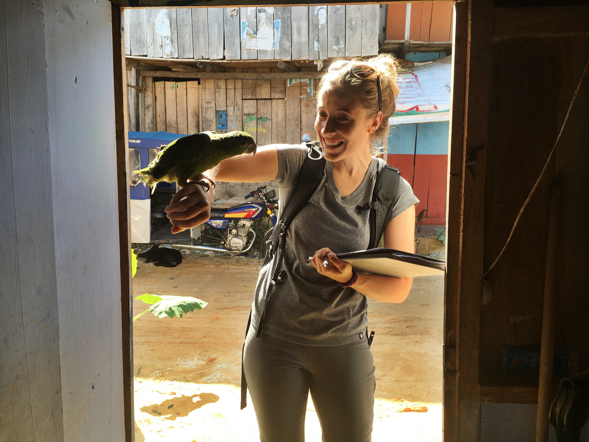

<h5>I am a 5th year PhD candidate in the [Epidemiology Graduate Group](https://www2.vetmed.ucdavis.edu/gge/index.cfm) and member of the [Barker Lab](https://barkerlab.ucdavis.edu/) at the University of California, Davis</h5>

***

 <h4>
__Personal Mission:__ 
</h4>
  

>To improve the health outcomes of the most marginalized and impoverished populations affected by vector-borne diseases through public health research.   

My research resides at the intersection of modeling, medical entomology, and
social determinants of health. I approach my work with enthusiasm, dedication, and compassion, and every project with goal of serving the communities I am studying. I do my best to ensure that all projects I work on or develop yield end products that aid in protecting vulnerable communities from vector-borne disease exposure. Ultimately, I strive to keep my research open and accesible, and believe that wealth should not be an obstacle to knowledge, prevention, or treatment.   

***  

 <h4>
__A little bit about me:__  
</h4>
   

I grew up in Chico, California, and moved to San Diego to study Environmental Systems and International Relations as UC San Diego (UCSD). While studying at UCSD, I fell in love with research while working as an undergraduate student researcher in a marine biology laboratory at the Scripps Institute of Oceanography and in a public health laboratory at the UC San Diego Department of Global Public Health. Through my ecology, biology, and statistics courses, I became fascinated by population leavel health, and knew that my undergraduate degree would not satisfy my drive to continue investigating. While finishing undergrad, I applied to PhD programs, and ultimately decided to pursue a PhD in the Graduate Group in Epidemiology at UC Davis. 

I currently live in Davis, California, where I am a fifth year PhD candidate in the Davis Arbovirus Research and Training Group (DART) with Dr. Chris Barker. I study the risk for local Zika and dengue virus transmission occuring in California, where *Aedes aegypti* populations continue to spread. My research focuses on understanding the sociodemographic drivers of *Ae. aegypti* abundance in urban regions of Southern California, the biological and environmental drivers *Ae. aegypti* blood and sugar-feeding, and the overall risk and dynamics of local *Aedes*-borne virus outbreaks occuring in California.  

