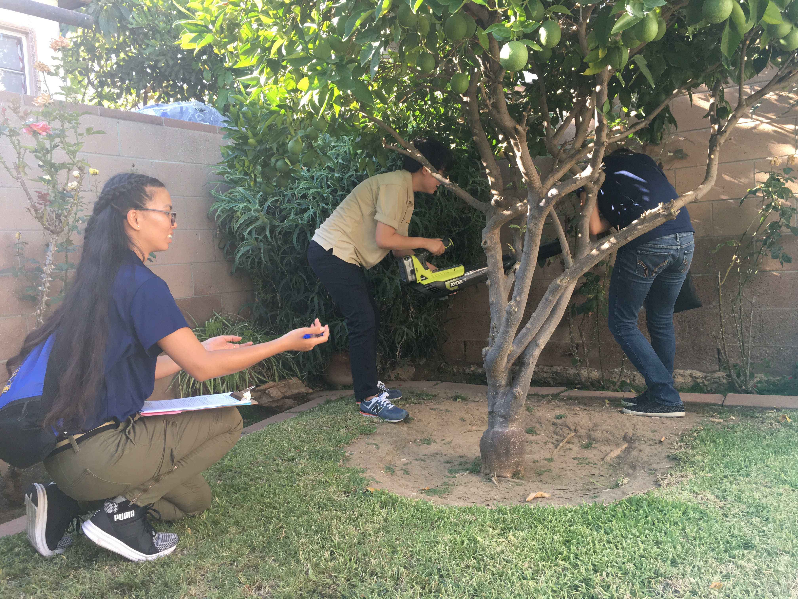
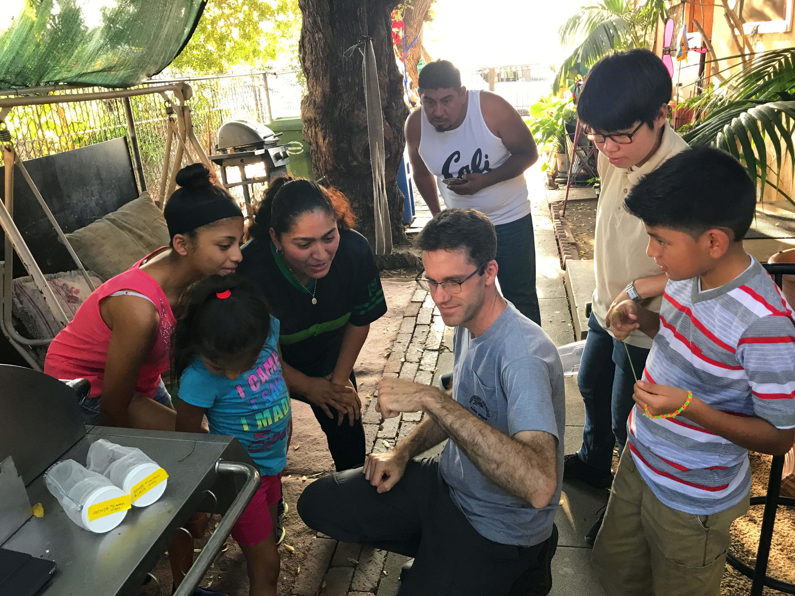
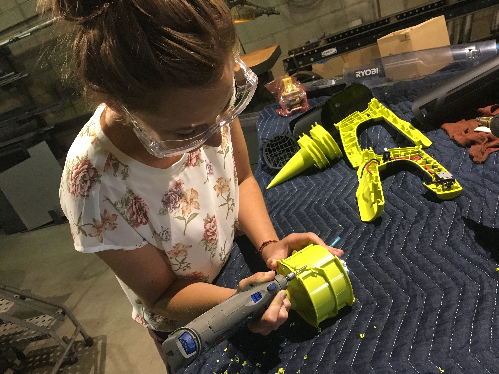
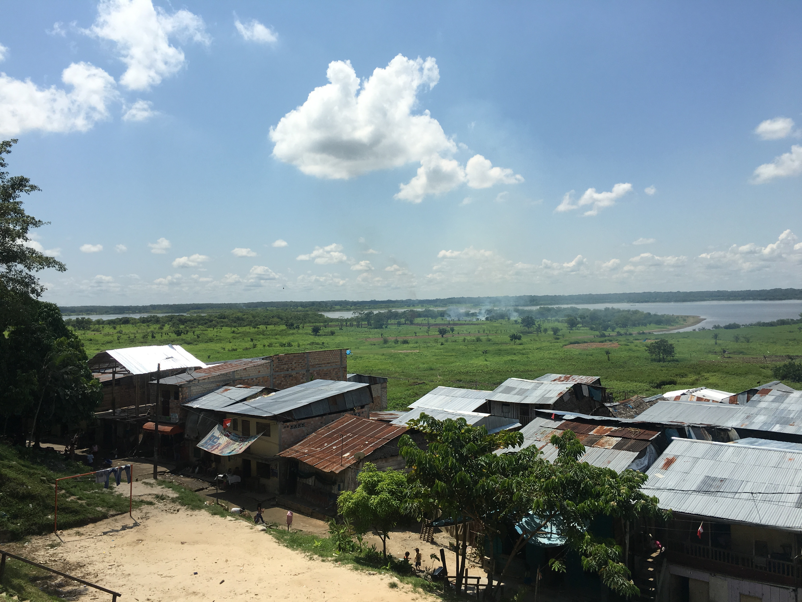
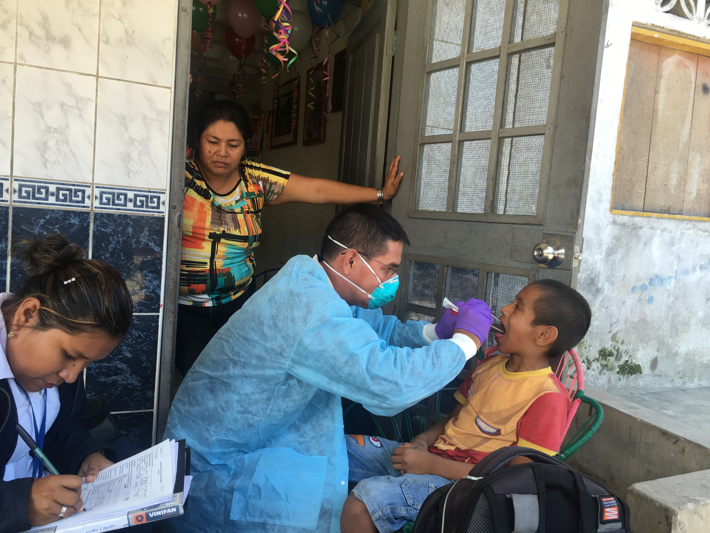
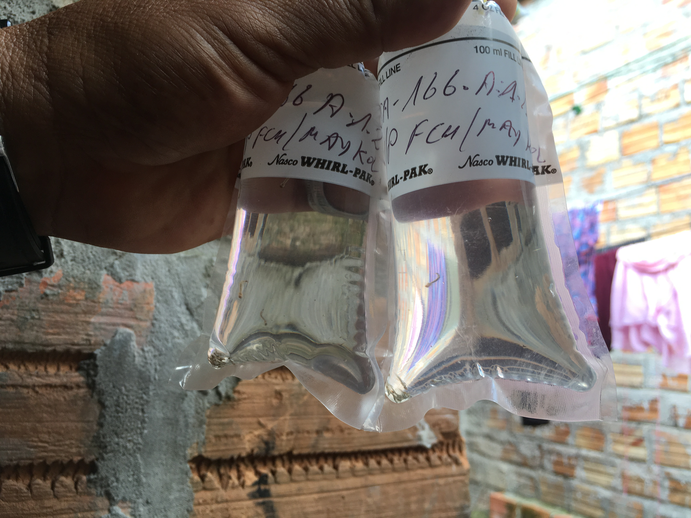

<h5>I am a bilingual infectious disease epidemiologist on a mission to improve the health outcomes of marginalized populations through applied public health and community engagement.</h5>

***

<h3>
The ecology, spread, and risk of invasive  *Aedes aegypti* in California
</h3>

<h5>
__Socio-demographic drivers of *Ae. aegypti* abundance in Los Angeles, CA:__ 
</h5>   
Aedes aegypti, a vector of Zika, dengue, chikungunya, and yellow fever viruses, has expanded its range in California in recent years. This species tends to thrive in low socio-economic status (SES) communities lacking adequate sanitation, and has been associated with risk of local dengue outbreaks; however, it is unclear how community infrastructure may influence the risk of local outbreaks in the U.S., where residential areas are structured differently than those in developing regions of the world where ZIKV and DENV are endemic. During the summer of 2017, I was the lead investigator on project in collaboration with the Greater Los Angeles County Vector Control District (GLACVCD), and ran a household survey of 163 participants in sociodemographically diverse communities in Los Angeles County (LA), CA. Our aim was to quantify sociodemographic disparities in the risk of local Zika and dengue outbreaks in California. We found that a decrease in income of approximately $20,000 was associated with a 30% increase in *Ae. aegypti* abundance at the household level, highlighting the need for community-specific vector control programs. The publication for this project is currently in its end-stages of editing and will be submitted to PLoS Neglected Tropical Diseases in late May 2019.

<figcaption><h6>Scenes from LA. While conducting field work, I had the pleasure of working with 3 AMAZING undergrads who helped me administer surveys and collect mosquitoes. Chris, my advisor, visited us in LA and "wow-ed" some of our participants with his mosquito-whispering talents (consent was given for photo). The mechanics at the Greater Los Angeles County Vector Control District were incredibly gracious and taught me to reverse the polarity on our leaf blowers for collecting mosquitoes.</h6></figcaption>
***  

<h5>
__Heterogeneities in *Ae. aegypti* blood and sugar-feeding in Los Anegeles, CA:__  
</h5>

In the U.S., some studies suggest that improved housing quality reduces exposure to *Ae. aegypti* biting; however, it unclear how household characteristics and human behaviors (e.g. air-conditioner usage) may modify feeding patterns. To better understand the relationships between household risk factors and Ae. aegypti biting, I identified bloodmeal hosts, quantified sugar-feeding prevalence, and identified disparities in human-*Ae. Aegypti* exposure and biting in LA. As part of this project, I developed a cheaper and more efficient assay to identify blood and sugar-feeding patterns in *Ae. aegypti* mosquitoes. The improved method I developed to detect blood and sugar-feeding in *Ae. aegypti* modifies the gold-standard anthrone anthrone and vanillin assays, which together quantify fructose, lipids, and glycogen in insects, and requires 1/3 of the time and 1/10 of the cost compared to the gold-standards. For this new protocol, I reduced and scaled the reagents required for the original assays to fit within 96-well microplates, which are used to read absorbance. To validate this new protocol, I tested it on two cohorts of lab mosquitoes with known feeding histories. I am now using this assay in conjunction with a classification algorithm to classify the adult *Ae. aegypti* I collected from LA households as having never taken a bloodmeal, likely taken one bloodmeal, or likely taken multiple bloodmeals. 

<figcaption><h6>The pink in the microplate wells are lipids extracted from *Ae. aegypti* reacting with a vanillin solution and the greem is glycogenreacting with an anthrone solution. For our experiment, I volunteered to feed a few hundred lab colony *Ae. aegypti* on my arm!</h6></figcaption>
***  

 <h5>
__Mapping past, present, and future climatic suitability of *Ae. aegypti* in the United States:__  
</h5>   
Rapid changes in the distributions of the mosquito species *Aedes aegypti* in the continental United States alter the potential for local transmission of dengue, chikungunya, and Zika viruses. The expanding range of these mosquitoes and discovery of new populations within the U.S. raises questions about whether recent spread has been enabled by climate change or other anthropogenic influences. In our analysis, we use daily average temperatures for the United States to model *Ae. aegypti* population growth rates using a stage-structured matrix population model to understand the past and present habitat suitability of this vector, and to project future habitat suitability under IPCC climate change scenario representative concentration pathway (RCP) 4.5. Our results indicate that much of the southern U.S. is suitable for *Ae. aegypti* year-round; however, a surprisingly large proportion of the U.S. in addition to the southern states is suitable for positive population growth for much of the year. Additionally, IPCC CMIP5 model projections of future climate change suggest that climate change will expand the range and increase population growth rates of *Ae. aegypti* in the U.S., potentially increasing the range of the viruses they transmit. We also used this model to build a web-based application (available here) to estimate seasonal population dynamics of *Ae. aegypti* and *Ae. albopictus* populations in California. 

***  

 <h3>
Zika and dengue epidemiology in Iquitos, Peru
</h3>

<h5>
__Proyecto Dengue; data management in Iquitos, Peru:__  
</h5>   

As the survey and data manager for the Proyecto Dengue Program Project Grant (P01, PIs Dr. Tom Scott and Dr. Amy Morrison), I developed and managed surveys and data-collection efforts for a longitudinal cohort study with over 15,000 participants under surveillance for dengue and Zika virus infections in Iquitos, Peru. My main duties were programming the CommCare mobile application system used to administer surveys in the field, designing surveys, translating and streamlining surveys and standard operating procedures into Spanish, field-testing applications and survey protocols in Iquitos, and administering trainings in Spanish on using the CommCare data collection application and data management to Peruvian doctors and field technicians in Iquitos. To to ensure that the surveys and mobile application system were user-friendly for the field-technicians while also maintained the integrity of the data, I served as a liaison between and communicated heavily with field technicians, project managers, the CommCare database management team, and project scientists. Additionally, I developed an extensive knowledge of dengue and Zika epidemiology and a strong understanding of the socio-demographic determinants of both diseases. 

<figcaption><h6>Scenes from Iquitos. The first photo is of a community residing next to the Amazon River. The second photo is of one of our Peruvian doctors testing a study participant for dengue virus (consent was given for photo). The third photo is of *Ae. aegypti* larvae collected at one of the participating households.</h6></figcaption>

***  

 <h3>
Climate change and heath equity in California, California Department of Public Health
</h3>

<h5>
__Projected future heat-related mobidity and motality attributed to climate change in California:__  
</h5>   
As a researcher for the Climate Change and Health Equity Program at the CDPH, I presently investigate the human morbidity and mortality burden attributed to ambient temperature and extreme heat and cold events in California. I applied for and was granted access to over 60 million records of emergency department and hospital admission data from the Office of Statewide Health Planning and Development. I used around eight million of these records to develop statistical models that project future temperature-related morbidity and mortality in California populations under different climate change scenarios. I focused on the most vulnerable populations (populations <65 years old, rural populations, outdoor workers) and identified the communities at greatest risk for increases in heat-related illness burden in the future. We are currently preparing a publication, with an estimated submission date of June 2019.
